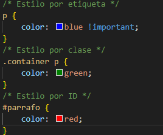
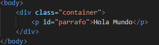
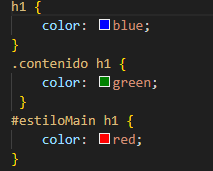
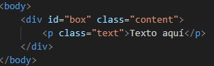
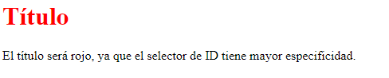
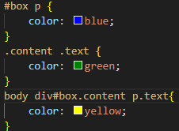
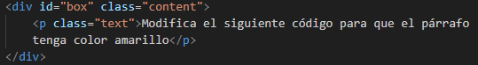
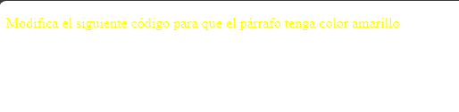

# TallerDeEspecificidad

Parte 1:
Puedes ver la presentación completa aquí: [Presentación Especificidad.pdf](Presentación%20Especificidad.pdf)
Parte 2: Ejemplos Prácticos

Ejemplo básico y demostracion de !important:
Demuestra cómo los diferentes selectores afectan la especificidad.
solucion : El color será azul, porque !important tiene prioridad, independientemente de la especificidad.

Ejecucion :

Parte 3: Ejercicios Prácticos

Ejercicio 1: Calculando la Especificidad
pide a los participantes que calculen la especificidad y determinen qué 
estilos se aplicarán.
¿Qué color tendrá el título Respuesta esperada:<h1> ?
El titulo sera color rojo.

    <h1>Título</h1>

Este es un párrafo.

Ejecucion :

Ejercicio 2: Resolviendo Conflictos de Especificidad
Modifica el siguiente código para que el párrafo tenga color amarillo, sin usar !important .

Ejecucion:

